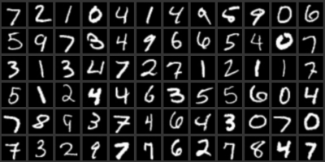
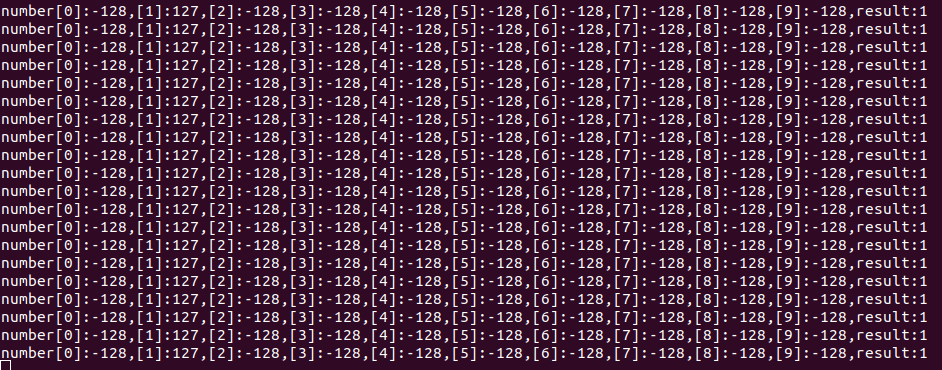

# handwriting example

This example try to recognize different number (0~9) based on training model from MNIST dataset. 

## Running on HIMAX WE1 EVB

During the example, images are captured by a camera and
  - send out original jpeg image through SPI interface 
  - dwonscale original mono image to 28x28 as input for model 

output result will be score of each category send out through Serial terminal like this. 

and you can also check sensor image by SPI output 

You can find SPI receive image tool [here](https://github.com/HimaxWiseEyePlus/bsp_tflu/tree/master/SPI_Tool). 

