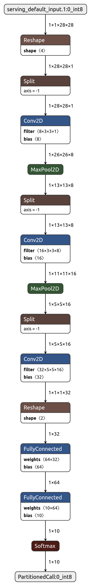

# Convert model from PyTorch to TensorFlow Lite for Microcontrollers

## Introduction
This example shows a flow of converting PyTorch to TensorFlow Lite(PyTorch --> ONNX --> TensorFlow --> TensorFlow Lite). We use the PyTorch MNIST model as an example and deploy it to HIMAX WE1 EVB. Please notice that TensorFlow Lite for Microcontrollers supported operator is a subset of TensorFlow Lite, more detailed information can be found [here](https://github.com/HimaxWiseEyePlus/himax_tflm/tree/master/tensorflow/lite/micro/kernels/micro_ops.h).

## Prerequisites
* Python >= 3.5
* torch == 1.7.1
* torchvision == 0.8.2
* onnx == 1.8.0 [(ONNX)](https://github.com/onnx/onnx)
* onnx-tf == 1.7.0 [(onnx-tensorflow)](https://github.com/onnx/onnx-tensorflow)
* tensorflow >= 2.3.1
* tensorflow-datasets >= 4.1.0

Recommend using virtual environments.
```bash
pip3 install virtualenv
python3 -m virtualenv venv
source venv/bin/activate

pip install -r requirements.txt
```

## Run The Example
```bash
python pytorch_mnist.py --no-cuda --save-model
python pytorch_to_onnx.py
python onnx_to_tf.py
python tf_to_tflite.py
```

## Tutorial

### 1. Train the PyTorch handwriting model
```bash
python pytorch_mnist.py --no-cuda --save-model
```


### 2. Converting Pytorch to ONNX
Use the [torch.onnx](https://pytorch.org/docs/stable/onnx.html) function to convert the Pytorch model to the ONNX model.
```python
import torch
import torch.nn as nn
import torch.nn.functional as F

from pytorch_mnist import Net

PYTORCH_PATH = "pytorch_mnist_cnn.pt"
ONNX_PATH = "mnist_cnn.onnx"

# Load the PyTorch model
trained_model = Net()
trained_model.load_state_dict(torch.load(PYTORCH_PATH))

# Export PyTorch model to ONNX model
dummy_input = torch.randn(1, 1, 28, 28, requires_grad=True)
torch.onnx.export(trained_model, dummy_input, ONNX_PATH, verbose=True)
```


(Optional) Use [netron](https://netron.app/) to check the model.
<div style="text-align:center"></div>


### 3. Converting ONNX to TensorFlow
Use the `onnx_tf.backend` to convert the ONNX model to the TensorFlow model.

```python
import onnx
from onnx_tf.backend import prepare

ONNX_PATH = "mnist_cnn.onnx"
TF_PATH = "mnist_cnn_tf"

# Load the ONNX model
onnx_model = onnx.load(ONNX_PATH)

# Export ONNX model to TensorFlow model
tf_model = prepare(onnx_model)
tf_model.export_graph(TF_PATH)
```

Test with the converted model.

```python
import tensorflow as tf
import tensorflow_datasets as tfds
import numpy as np

# Load the mnist dataset
ds, info = tfds.load('mnist', split='test', with_info=True)

# Load the TensorFlow model
imported = tf.saved_model.load(TF_PATH)
f = imported.signatures["serving_default"]

# ----test with TensorFlow model----
tf_test_acc = tf.keras.metrics.SparseCategoricalAccuracy()

for example in ds:
    image = np.array(example["image"],dtype="float32")
    label = example["label"]
    inputs = tf.reshape(image,[1,1,28,28])

    output = f(inputs)['output_0']
    tf_test_acc.update_state(y_true=label, y_pred=output)

print("TensorFlow model test accuracy: {}%".format(tf_test_acc.result() * 100))
```


(Optional) Use CLI to convert. [ONNX-Tensorflow Command Line Interface](https://github.com/onnx/onnx-tensorflow/blob/master/doc/CLI.md#onnx-tensorflow-command-line-interface)
```bash
onnx-tf convert -i ./mnist_cnn.onnx -o mnist_cnn_tf
```

### 4. Convert TensorFlow to TensorFlow Lite and Quantization
Use `tf.lite.TFLiteConverter` to convert the TensorFlow model into the TensorFlow Lite model and set the optimization option to quantize the model.

```python
import os
import numpy as np
import tensorflow as tf
import tensorflow_datasets as tfds

TF_PATH = "mnist_cnn_tf"
TFLITE_PATH = "mnist_dynamic_quantized_28x28.tflite"

# Load the mnist dataset
ds, info = tfds.load('mnist', split='train', with_info=True)

# Make a converter object from the saved tensorflow file
converter = tf.lite.TFLiteConverter.from_saved_model(TF_PATH)
converter.optimizations = [tf.lite.Optimize.DEFAULT]

# Representative data generator function
def representative_data_gen():
    for input_value in ds.batch(1).take(10000):
        yield [tf.reshape(np.array(input_value["image"],dtype="float32"),[1,1,28,28])]

# Set optimization Strategy and representative dataloader of converter.
converter.representative_dataset = representative_data_gen
converter.target_spec.supported_ops = [tf.lite.OpsSet.TFLITE_BUILTINS_INT8]

# Set the input and output tensors to int8 
converter.inference_input_type = tf.int8
converter.inference_output_type = tf.int8

# Start quantize the model
tflite_model_quant = converter.convert()

# Save the model.
with open(os.path.join(os.getcwd(), TFLITE_PATH), mode='wb') as f:
        f.write(tflite_model_quant)
```

Test with the quantize model.
```python
# ----test with quantize model----
ds, info = tfds.load('mnist', split='test', with_info=True)

interpreter = tf.lite.Interpreter(model_path=TFLITE_PATH)
input_details = interpreter.get_input_details()
output_details = interpreter.get_output_details()
scales = output_details[0]["quantization_parameters"]["scales"][0]
zero_points = output_details[0]["quantization_parameters"]["zero_points"][0]
interpreter.allocate_tensors()

quantized_test_acc = tf.keras.metrics.SparseCategoricalAccuracy()

for example in ds:
    image = np.array((example["image"]-128),dtype="int8")
    label = example["label"]

    inputs = tf.reshape(image,[1,1,28,28])

    interpreter.set_tensor(input_details[0]["index"], tf.cast(inputs, dtype=tf.int8))
    interpreter.invoke()
    
    output = interpreter.get_tensor(output_details[0]['index'])
    output = (output + (-zero_points)) * scales
    
    quantized_test_acc.update_state(y_true=label, y_pred=output)


print("Quantized test accuracy: {}%".format(quantized_test_acc.result() * 100))
```


Use [netron](https://netron.app/) to check the model.

<div style="text-align:center"></div>

### 5. Convert .tflite file to C file
```bash
xxd -i mnist_dynamic_quantized_28x28.tflite model_data.cc
```

### 6. Modification of [himax_tflm handwriting example](https://github.com/HimaxWiseEyePlus/himax_tflm/tree/master/tensorflow/lite/micro/examples/handwriting)

Follow the steps of handwriting example [here](https://github.com/HimaxWiseEyePlus/himax_tflm#deploy-to-himax-we1-evb) to download third party library first.

```
make download
```

Replace `model_data.cc` to the handwriting example located at `tensorflow/lite/micro/tools/make/downloads/handwriting/`.

modify OpResolver to `main_functions.cc`.
```c++
static tflite::MicroMutableOpResolver<6> micro_op_resolver;
micro_op_resolver.AddConv2D();
micro_op_resolver.AddReshape();
micro_op_resolver.AddSplit();
micro_op_resolver.AddMaxPool2D();
micro_op_resolver.AddFullyConnected();
micro_op_resolver.AddSoftmax();
```
Build handwriting example and flash image, flash image name will be `handwriting.img`.

```
make handwriting
make flash example=handwriting
```

### 7. Running on HIMAX WE1 EVB

After above steps, update `handwriting.img` to HIMAX WE1 EVB and result can be found at console terminal. Please check [here](https://github.com/HimaxWiseEyePlus/bsp_tflu/tree/master/HIMAX_WE1_EVB_user_guide#flash-image-update-at-linux-environment) if any issues about updating flash.

In the console terminal, we can see the highest score is number 0 when HIMAX WE1 EVB image sensor point to test image `number 0`.
